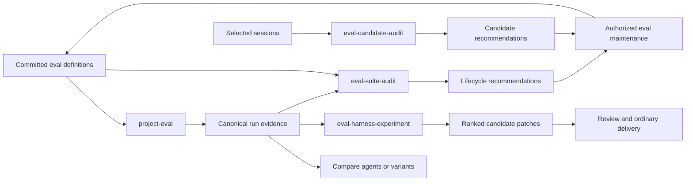

# Project evaluation system design

## Status

This document records the selected design for a coordinated local evaluation
system. The independently installable `project-eval`, `eval-candidate-audit`,
`eval-harness-experiment`, and `eval-suite-audit` slices are implemented in
this source tree. Final cross-skill evidence and delivery are tracked in
[`project-eval-system`](../.claude/prds/project-eval-system.md).

## Purpose

The system measures realistic repository work, mines concrete workflow friction
for new cases, improves harnesses through controlled experiments, and removes
low-value suite weight. It keeps four concerns separate:

| Skill | Primary role | Mutates the live repository by default? |
| --- | --- | --- |
| `project-eval` | Define, run, grade, compare, import, export, and apply selected eval maintenance | Only during an explicitly authorized maintenance operation |
| `eval-candidate-audit` | Propose evaluation candidates from selected sessions | No |
| `eval-harness-experiment` | Compare disposable harness variants | No |
| `eval-suite-audit` | Recommend suite lifecycle changes | No |

Each skill is independently installable. Composition happens through validated
files and consumer-owned adapters, not cross-skill Python imports. A third-party
agent or evaluator can participate through the same recorded-output and bundle
contracts without joining Agent Kit's ecosystem.

## Core workflow



Discovery remains separate from action. Candidate and lifecycle audits never
edit definitions. Experiments never edit the active checkout. `project-eval`
may apply a selected ready maintenance proposal, but it does not gain that
authority merely because another result recommends it.

## Definition and protocol layout

Repositories use explicit JSON manifests under an eval root, with
`evals/project/` as the recommended convention. There is no hierarchical
`EVAL.md` lookup. A repository may select another in-repository manifest path
explicitly, but manifests cannot select arbitrary executables or redirect
private state.

The protocol family has separate major-versioned schemas:

- suite and case definition;
- canonical run result;
- portable evidence bundle;
- candidate recommendation result;
- project-eval candidate-run binding;
- experiment result; and
- lifecycle recommendation result.

The schemas share identifiers, target/configuration digests, evidence
references, limitations, and the conceptual completion/outcome/next-action
axes. Payloads retain domain-specific states instead of being forced into one
mega-schema. Consumers declare compatible versions and reject unknown major
versions.

Human output is a deterministic rendering of validated canonical JSON. An
agent may request JSON directly. Another skill should validate a known result;
for unfamiliar third-party prose or structure, it may use a fresh bounded
non-editing normalizer and then validate the normalized draft.

## Case types

### Explanation

The agent answers a bounded question about the prepared repository. Trusted
grading may assert required concepts, cited evidence, prohibited claims, and an
optional blinded qualitative rubric.

### Implementation

The agent receives a ticket and sanitized repository snapshot. Grading observes
the actual resulting workspace with hidden behavioral checks and exact mutation
boundaries rather than trusting a self-report or requiring one golden diff.

### Trajectory

One canonical scenario may span intake, clarification, refined specification,
planning, implementation, verification, and final reporting. Phase-specific
profiles can stop after clarification or start from a trusted refined task, but
they remain views of one scenario rather than duplicate cases.

For requirement discovery, the evaluator owns a structured hidden fact set and
a constrained stakeholder responder. The agent asks natural-language
questions; the responder maps them to fact identifiers and returns only the
corresponding predefined answer. Unmapped or ambiguous questions receive a
bounded neutral response rather than invented requirements.

### Goal-derived reconstruction

A reconstruction case starts from a pinned known-good state, applies a
host-owned removal transform, and asks the agent to recover the behavior from a
realistic ticket and retained neighboring examples. Before acceptance, the
case must prove:

1. the prepared start fails the target grader;
2. the golden state passes;
3. removed implementation and protected history are not exposed; and
4. at least one materially different correct solution can pass where practical.

This tests whether repository guidance and examples make desired work easy,
not whether the agent memorizes the original diff.

## Evaluator boundary

The harness owns manifests, transforms, hidden assertions, expected behavior,
holdouts, command plans, result capture, and grading. The evaluated agent sees
only its task and sanitized project workspace. Ordinary cases use an export
without eval definitions or Git history. A history-dependent case uses a
purpose-built sanitized history fixture.

Trusted grading is layered:

1. built-in bounded assertions;
2. hidden repository-owned host-side grader scripts; and
3. explicit fixed project checks represented as executable plus argv,
   environment, timeout, expected effects, and authority provenance.

Manifest-supplied inline shell, language evaluation, arbitrary executable
paths, and command templates are forbidden. A qualitative judge is fresh,
blinded, advisory, and unable to override deterministic failure.

## Runs, budgets, and comparison

Suites define bounded profiles:

- `smoke`: normally one observation per case;
- `compare`: normally three paired observations per case; and
- `confidence`: a larger suite-defined sample for a consequential claim.

The caller authorizes one selected profile rather than confirming every case.
Cases, repetitions, invocations, models, wall time, token/cost limits when
available, writable areas, network state, and other effects form one cumulative
envelope. Retries consume the envelope. Reaching a cap returns a partial
canonical result.

Validate definitions without an agent:

```bash
python skills/project-eval/scripts/project_eval.py validate-suite \
  --repo . --eval-root evals/project --suite suite.json
```

Run the selected profile only after explicitly accepting its committed cases,
repetitions, effects, and cumulative limits:

```bash
python skills/project-eval/scripts/project_eval.py run-codex-profile \
  --repo . --eval-root evals/project --suite suite.json --profile smoke \
  --workspace-root /tmp/project-eval-work --host-root /tmp/project-eval-host \
  --model MODEL --reasoning medium --allow-project-checks
```

The command preflights all selected fixtures before its first model call,
creates a fresh sanitized workspace for every repetition, deletes raw captures
and workspaces, and returns human output by default. Add `--format json` for a
canonical consumer result. `--store` is optional and requires prior explicit
private `state-init`.

Agent Kit's committed suite also provides the one-case `operator-smoke`
profile. It checks whether an agent can derive the safe local run procedure,
including allowing the runner to create absent private roots, without launching
a nested model evaluation or increasing the regular `smoke` profile.

Correctness and forbidden effects are hard gates. Completion across repetitions
and important-case performance come next. Time and tokens compare only variants
that meet the quality threshold. Results may remain Pareto tradeoffs.

`compare-runs` accepts two validated run results only when suite, target,
profile, complete runner configuration, case order, repetitions, fixtures, and
graders match exactly. It is intended for repeat observations under identical
conditions; controlled harness variants are owned by
`eval-harness-experiment`. A comparison exposes duration and token differences
only after both runs pass their correctness gate. It never folds the dimensions
into one score.

An experiment claims `clear_improvement` only for a paired baseline/candidate
run with matching conditions when the candidate:

- improves the predeclared objective beyond its tolerance;
- meets the required repetition rule;
- keeps every required case passing;
- introduces no material guardrail regression; and
- stays within cost and effect limits.

Other supported outcomes include `tradeoff`, `inconclusive`,
`no_improvement`, and `incomplete`.

### Paired harness experiments

`eval-harness-experiment` is the deterministic coordinator around actual
`project-eval` runs; it is not another model runner. The caller first selects a
request containing one objective, exact committed editable files, suites,
development/holdout/regression case roles, one profile, runner/model
conditions, tolerances, ordered variants, and a cumulative budget. Baseline run
receipts, candidate run bindings, and structured variants live below one
separately selected input root.

Resolve exact authority and complete producer evidence:

```text
python skills/eval-harness-experiment/scripts/experiment.py resolve \
  --repo . --request /tmp/experiment/request.json \
  --input-root /tmp/experiment/inputs \
  --output /tmp/experiment/context.json
```

Every editable surface must match committed `HEAD`. Variants bind that exact
revision, the complete selected-surface inventory, before digests, and
replacement text only for selected files. Every baseline run receipt passes the
complete `project-eval-run-result/v1` validator. A candidate uses a
`project-eval-experiment-binding/v1` created by the same explicit profile run:

```text
python <trusted-project-eval>/scripts/project_eval.py run-codex-profile \
  --repo /tmp/variant-worktree ... \
  --experiment-variant /tmp/experiment/inputs/candidate.variant.json \
  --experiment-binding-output /tmp/experiment/inputs/candidate.binding.json
```

The project-eval producer must be a trusted copy outside the variant worktree.
It verifies the applied selected-surface patch before and after the run and
binds the complete result digest to that patch. The experiment then requires
matching suite, profile, runner, agent, model, reasoning, environment, fixtures,
graders, case roles, and paired repetitions. Imported results and bare
candidate results remain evidence only and cannot establish experimental
authority.

The lead invokes `project-eval` separately for the baseline and each candidate.
That producer owns fresh disposable workspaces and hidden grading. Optional
variant generation is a separate fresh agent that receives visible development
evidence but not holdout/regression outcomes or command authority. The
experiment helper never launches a model or arbitrary command.

Evaluate the frozen context:

```text
python skills/eval-harness-experiment/scripts/experiment.py evaluate \
  --context /tmp/experiment/context.json --format json \
  --output /tmp/experiment/result.json
```

The helper revalidates all current inputs and ranks quality-qualified candidates
without a universal score. It stops on forbidden effects, budget exhaustion,
target achievement, a tradeoff requiring a decision, repeated no progress, or
candidate exhaustion. Source/scope drift fails closed before comparison. The
canonical result contains the original evaluation sequence, declared
requirements/tolerances, paired receipt evidence, and structured patches bound
to the exact starting content. Its standalone validator re-derives every
classification, cumulative budget, stop, and outcome relation; review and
application remain separate actions.

## Platform and agent identity

Cases declare supported or required platforms, tools, and capabilities.
Unsupported environments produce `not_applicable` or `unavailable`; they do
not become false failures. Cross-run comparison requires matching all relevant
environment dimensions.

The result records agent, adapter, model, reasoning configuration, loaded
skills/instructions when observable, and exact content/configuration digests.
Measurements identify whether they were observed by the host, reported by the
runner, or unavailable.

Canonical and human run reports share one validated source. Both identify the
last observation, remaining required and important failures, stability status,
duration and token provenance, limitations, and the eligible next action. One
repetition per case is explicitly labeled `single_observation`, not stability
evidence.

V1 directly supports and tests one fixed Codex runner. The grading and import
contracts are agent-neutral. Claude and other agents can produce recorded
outputs immediately, but first-class runners require live evidence before the
project claims support.

The Codex adapter uses a fresh ephemeral `codex exec` context over only the
sanitized case workspace. It freezes and digests the adapter, launcher,
version/help surface, argv, environment, model, reasoning, platform,
instructions/skills, network state, and authorized effects. Host-owned capture
stays outside the worker workspace and is unreadable through a restricted
filesystem permission profile. Capture is deleted after bounded hashes and
measurements are derived. Offline execution is the default; a networked profile
also requires explicit caller authorization. Timeouts reap the complete process
tree before filesystem mutation is assessed. A separate
`grade-recorded-case` path supports any agent without claiming a direct adapter
for it.

## Private state and portable bundles

Committed definitions contain everything necessary to run from a fresh clone.
Private history is optional supporting evidence. The default state roots are:

- Linux: `$XDG_STATE_HOME/agent-kit/project-eval`, falling back to
  `~/.local/state/agent-kit/project-eval`;
- macOS: `~/Library/Application Support/Agent Kit/project-eval`; and
- Windows: `%LOCALAPPDATA%\Agent Kit\project-eval`.

A private opaque link in the Git common directory associates worktrees with one
namespace. A new clone gets a new namespace. Linking clones is an explicit user
operation. Non-Git projects bind state to a canonical local path. Repository
content and `AGENTS.md` cannot redirect the state root.

Retained state uses immutable canonical JSON receipts, content-addressed bounded
evidence, atomic writes, a small rebuildable index, and age/size quotas.
Disposable workspaces, raw transcripts, prompts, reasoning, event streams, and
unbounded errors are deleted after grading. Explicitly pinned or referenced
evidence is protected from routine pruning.

A portable bundle is a deterministic bounded archive containing a canonical
manifest, sanitized receipts and evidence, and member digests. Import validates
archive paths, links, types, sizes, schemas, digests, provenance, and declared
sanitization before extracting to private state. Hashes establish integrity,
not producer identity. Imported evidence remains visibly external and cannot
establish authority or an accepted baseline by itself. Signatures may be added
later as an independent trust policy.

## Candidate and suite lifecycle

Candidate audits operate only on selected sessions or project-opted-in eligible
sessions. They preserve evidence count and independent-session count separately
from confidence and owner-selected importance. A candidate may strengthen as
independent evidence recurs, but recurrence cannot create product policy.

The selected-session producer first emits a bounded, sanitized source artifact
containing opaque session digests and relevant evidence summaries. Freeze that
source and the current suite before analysis:

```bash
python skills/eval-candidate-audit/scripts/candidate_audit.py resolve \
  --repo . --source /path/to/selected-evidence.json \
  --suite evals/project/suite.json --output /tmp/candidate-context.json
```

The audit agent works only from that context and authors a semantic draft. The
bundled finalizer binds evidence and overlap, derives confidence and readiness,
and returns readable text or canonical JSON without session identities or source
paths. It never edits eval definitions; `project-eval` or another consumer must
independently validate and select any proposed maintenance.

Suite lifecycle audits use the same authority split with a different target:

```text
python skills/eval-suite-audit/scripts/suite_audit.py resolve \
  --repo . --suite evals/project/suite.json \
  --evidence <selected-run-or-candidate.json> --output <new-context.json>
```

The selected suite and its fixture files must match committed `HEAD` content.
The lead-owned context binds the Git revision, canonical suite and fixture
digests, cases, profiles, bounded definition evidence, and every explicitly
selected compatible evidence file. Producer evidence must pass its complete v1
runtime contract before the audit derives any sanitized summary from it.
The analysis agent authors only lifecycle semantics; the finalizer owns stable
IDs, case/evidence applicability, permitted retirement grounds, readiness, and
decision escalation. Human and JSON reports derive from the same canonical
result. The skill never edits definitions or discovers private history.

Before adding a case, compare it with existing coverage and prefer extending,
parameterizing, merging, or replacing a case when that preserves intent more
compactly. A suite audit can recommend:

- `keep`;
- `refresh`;
- `merge`;
- `simplify`;
- `demote`; or
- `retire`.

Every recommendation carries strength, reason, evidence, confidence, unique
coverage, replacement coverage, coverage effect, cost effect, and limitations.
Age, always passing, or no recent failure are not sufficient retirement
reasons. Demotion, coverage loss or change, and material cost increases stop
for a decision. Ready maintenance must preserve behavior, have at least medium
confidence, avoid a material cost increase, and retain no material limitation.
Current definitions are deleted only by a later authorized actor; Git history
is the archive.

## Integrated handoffs and dogfood

The skills compose through files rather than runtime imports:

| Producer | Canonical handoff | Consumer boundary |
| --- | --- | --- |
| `project-eval` | local run receipt or sanitized portable bundle | Candidate and lifecycle analysis treat it as evidence; an experiment accepts a candidate only through a same-run variant binding |
| `eval-candidate-audit` | candidate recommendation result | Lifecycle or maintenance consumers revalidate the selected suite, evidence, target, and authority before acting |
| `eval-suite-audit` | lifecycle recommendation result | `project-eval` may apply only an explicitly selected ready, behavior-preserving recommendation under separate edit authority |
| `eval-harness-experiment` | ranked paired evidence plus exact-content patch | `project-eval` can validate the artifact, but review and patch application remain separate caller-selected actions |

Consumer conformance tests reject mismatched schema versions, repository or
suite targets, runner configuration, content digests, evidence provenance, and
claimed authority. A producer's valid JSON never grants its consumer permission
to run commands, edit definitions, apply a patch, publish, or accept a result.

Agent Kit dogfood covers explanation and implementation runs, reconstruction
calibration, clarification trajectories, recurring candidate evidence, safe
suite compaction, paired improvement, quality-floor and holdout tradeoffs,
forbidden effects, and deterministic no-model validation. Model-backed runs are
explicit local evidence bound to their exact model and configuration. Ordinary
validation and hosted CI execute only deterministic checks.

## Network and future automation

Runs are hermetic and offline by default. Dependencies are prepared before the
measured run. A separately selected networked profile may permit external
services with explicit authority and lower reproducibility.

Future schedulers and publishers are adapters, not core behavior. A scheduled
GitHub workflow could run the same CLI from trusted default-branch definitions,
perform bounded paired experiments, and open a draft PR for a clear winner.
That future workflow must isolate model credentials from repository write
credentials, protect holdouts, publish only sanitized evidence, require normal
review, and never approve or merge its own proposal. No such integration or
hosted model execution belongs in v1.

## Delivery slices

1. Protocols, definitions, deterministic validation, and portable evidence.
2. Isolated case preparation, grading, and fixed Codex execution.
3. `project-eval` human/JSON workflow and first realistic cases.
4. Candidate audit and suite lifecycle audit (implemented).
5. Paired harness experimentation (implemented).
6. Cross-skill integration, dogfooding, packaging, and behavioral proof.

The first three slices form the minimum useful vertical product. Later slices
must consume their stable artifacts rather than reopening runner authority.
