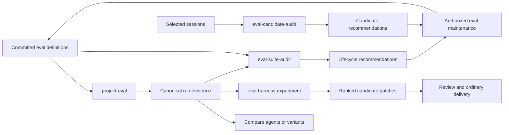

# Project evaluation system design

## Status

This document records the selected design for a coordinated local evaluation
system. It is an implementation contract, not a claim that the four skills
already exist. Delivery is tracked in
[`project-eval-system`](../.claude/prds/project-eval-system.md).

## Purpose

The system measures realistic repository work, mines concrete workflow friction
for new cases, improves harnesses through controlled experiments, and removes
low-value suite weight. It keeps four concerns separate:

| Skill | Primary role | Mutates the live repository by default? |
| --- | --- | --- |
| `project-eval` | Define, run, grade, compare, import, export, and apply selected eval maintenance | Only during an explicitly authorized maintenance operation |
| `eval-candidate-audit` | Propose evaluation candidates from selected sessions | No |
| `eval-harness-experiment` | Compare disposable harness variants | No |
| `eval-suite-audit` | Recommend suite lifecycle changes | No |

Each skill is independently installable. Composition happens through validated
files and consumer-owned adapters, not cross-skill Python imports. A third-party
agent or evaluator can participate through the same recorded-output and bundle
contracts without joining Agent Kit's ecosystem.

## Core workflow

Discovery remains separate from action. Candidate and lifecycle audits never
edit definitions. Experiments never edit the active checkout. `project-eval`
may apply a selected ready maintenance proposal, but it does not gain that
authority merely because another result recommends it.

## Definition and protocol layout

Repositories use explicit JSON manifests under an eval root, with
`evals/project/` as the recommended convention. There is no hierarchical
`EVAL.md` lookup. A repository may select another in-repository manifest path
explicitly, but manifests cannot select arbitrary executables or redirect
private state.

The protocol family has separate major-versioned schemas:

- suite and case definition;
- canonical run result;
- portable evidence bundle;
- candidate recommendation result;
- experiment result; and
- lifecycle recommendation result.

The schemas share identifiers, target/configuration digests, evidence
references, limitations, and the conceptual completion/outcome/next-action
axes. Payloads retain domain-specific states instead of being forced into one
mega-schema. Consumers declare compatible versions and reject unknown major
versions.

Human output is a deterministic rendering of validated canonical JSON. An
agent may request JSON directly. Another skill should validate a known result;
for unfamiliar third-party prose or structure, it may use a fresh bounded
non-editing normalizer and then validate the normalized draft.

## Case types

### Explanation

The agent answers a bounded question about the prepared repository. Trusted
grading may assert required concepts, cited evidence, prohibited claims, and an
optional blinded qualitative rubric.

### Implementation

The agent receives a ticket and sanitized repository snapshot. Grading observes
the actual resulting workspace with hidden behavioral checks and exact mutation
boundaries rather than trusting a self-report or requiring one golden diff.

### Trajectory

One canonical scenario may span intake, clarification, refined specification,
planning, implementation, verification, and final reporting. Phase-specific
profiles can stop after clarification or start from a trusted refined task, but
they remain views of one scenario rather than duplicate cases.

For requirement discovery, the evaluator owns a structured hidden fact set and
a constrained stakeholder responder. The agent asks natural-language
questions; the responder maps them to fact identifiers and returns only the
corresponding predefined answer. Unmapped or ambiguous questions receive a
bounded neutral response rather than invented requirements.

### Goal-derived reconstruction

A reconstruction case starts from a pinned known-good state, applies a
host-owned removal transform, and asks the agent to recover the behavior from a
realistic ticket and retained neighboring examples. Before acceptance, the
case must prove:

1. the prepared start fails the target grader;
2. the golden state passes;
3. removed implementation and protected history are not exposed; and
4. at least one materially different correct solution can pass where practical.

This tests whether repository guidance and examples make desired work easy,
not whether the agent memorizes the original diff.

## Evaluator boundary

The harness owns manifests, transforms, hidden assertions, expected behavior,
holdouts, command plans, result capture, and grading. The evaluated agent sees
only its task and sanitized project workspace. Ordinary cases use an export
without eval definitions or Git history. A history-dependent case uses a
purpose-built sanitized history fixture.

Trusted grading is layered:

1. built-in bounded assertions;
2. hidden repository-owned host-side grader scripts; and
3. explicit fixed project checks represented as executable plus argv,
   environment, timeout, expected effects, and authority provenance.

Manifest-supplied inline shell, language evaluation, arbitrary executable
paths, and command templates are forbidden. A qualitative judge is fresh,
blinded, advisory, and unable to override deterministic failure.

## Runs, budgets, and comparison

Suites define bounded profiles:

- `smoke`: normally one observation per case;
- `compare`: normally three paired observations per case; and
- `confidence`: a larger suite-defined sample for a consequential claim.

The caller authorizes one selected profile rather than confirming every case.
Cases, repetitions, invocations, models, wall time, token/cost limits when
available, writable areas, network state, and other effects form one cumulative
envelope. Retries consume the envelope. Reaching a cap returns a partial
canonical result.

Correctness and forbidden effects are hard gates. Completion across repetitions
and important-case performance come next. Time and tokens compare only variants
that meet the quality threshold. Results may remain Pareto tradeoffs.

An experiment claims `clear_improvement` only for a paired baseline/candidate
run with matching conditions when the candidate:

- improves the predeclared objective beyond its tolerance;
- meets the required repetition rule;
- keeps every required case passing;
- introduces no material guardrail regression; and
- stays within cost and effect limits.

Other supported outcomes include `tradeoff`, `inconclusive`,
`no_improvement`, and `incomplete`.

## Platform and agent identity

Cases declare supported or required platforms, tools, and capabilities.
Unsupported environments produce `not_applicable` or `unavailable`; they do
not become false failures. Cross-run comparison requires matching all relevant
environment dimensions.

The result records agent, adapter, model, reasoning configuration, loaded
skills/instructions when observable, and exact content/configuration digests.
Measurements identify whether they were observed by the host, reported by the
runner, or unavailable.

V1 directly supports and tests one fixed Codex runner. The grading and import
contracts are agent-neutral. Claude and other agents can produce recorded
outputs immediately, but first-class runners require live evidence before the
project claims support.

## Private state and portable bundles

Committed definitions contain everything necessary to run from a fresh clone.
Private history is optional supporting evidence. The default state roots are:

- Linux: `$XDG_STATE_HOME/agent-kit/project-eval`, falling back to
  `~/.local/state/agent-kit/project-eval`;
- macOS: `~/Library/Application Support/Agent Kit/project-eval`; and
- Windows: `%LOCALAPPDATA%\Agent Kit\project-eval`.

A private opaque link in the Git common directory associates worktrees with one
namespace. A new clone gets a new namespace. Linking clones is an explicit user
operation. Non-Git projects bind state to a canonical local path. Repository
content and `AGENTS.md` cannot redirect the state root.

Retained state uses immutable canonical JSON receipts, content-addressed bounded
evidence, atomic writes, a small rebuildable index, and age/size quotas.
Disposable workspaces, raw transcripts, prompts, reasoning, event streams, and
unbounded errors are deleted after grading. Explicitly pinned or referenced
evidence is protected from routine pruning.

A portable bundle is a deterministic bounded archive containing a canonical
manifest, sanitized receipts and evidence, and member digests. Import validates
archive paths, links, types, sizes, schemas, digests, provenance, and declared
sanitization before extracting to private state. Hashes establish integrity,
not producer identity. Imported evidence remains visibly external and cannot
establish authority or an accepted baseline by itself. Signatures may be added
later as an independent trust policy.

## Candidate and suite lifecycle

Candidate audits operate only on selected sessions or project-opted-in eligible
sessions. They preserve evidence count and independent-session count separately
from confidence and owner-selected importance. A candidate may strengthen as
independent evidence recurs, but recurrence cannot create product policy.

Before adding a case, compare it with existing coverage and prefer extending,
parameterizing, merging, or replacing a case when that preserves intent more
compactly. A suite audit can recommend:

- `keep`;
- `refresh`;
- `merge`;
- `simplify`;
- `demote`; or
- `retire`.

Every recommendation carries strength, reason, evidence, confidence, unique
coverage, replacement coverage, cost effect, and limitations. Age, always
passing, or no recent failure are not sufficient retirement reasons. Current
definitions are deleted when retired; Git history is the archive.

## Network and future automation

Runs are hermetic and offline by default. Dependencies are prepared before the
measured run. A separately selected networked profile may permit external
services with explicit authority and lower reproducibility.

Future schedulers and publishers are adapters, not core behavior. A scheduled
GitHub workflow could run the same CLI from trusted default-branch definitions,
perform bounded paired experiments, and open a draft PR for a clear winner.
That future workflow must isolate model credentials from repository write
credentials, protect holdouts, publish only sanitized evidence, require normal
review, and never approve or merge its own proposal. No such integration or
hosted model execution belongs in v1.

## Delivery slices

1. Protocols, definitions, deterministic validation, and portable evidence.
2. Isolated case preparation, grading, and fixed Codex execution.
3. `project-eval` human/JSON workflow and first realistic cases.
4. Candidate audit and suite lifecycle audit.
5. Paired harness experimentation.
6. Cross-skill integration, dogfooding, packaging, and behavioral proof.

The first three slices form the minimum useful vertical product. Later slices
must consume their stable artifacts rather than reopening runner authority.
