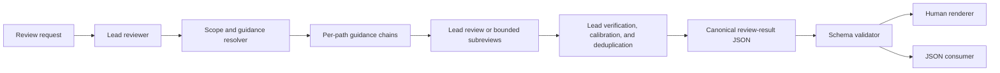

# Project-review design

Status: implemented and validated locally; release delivery is separate.

## Purpose

`project-review` is a portable, review-only workflow for bounded project changes
and files. It lets code owners keep specialized review guidance in hierarchical
`REVIEW.md` files while giving interactive users and downstream agents the same
validated result.

The skill does not publish, approve, fix, or merge anything. Those are separate
workflows that may consume its JSON result later.

## Why a separate skill

Codex can use path-scoped `## Code Review Rules` in `AGENTS.md`, while Claude Code
Review currently uses hierarchical `CLAUDE.md` context and a root-level,
review-specific `REVIEW.md`. Those native features are useful, but they differ in
scope and output. This skill defines a cross-agent contract: review-only files at
every directory level, trusted-base resolution for change reviews, explicit
coverage, and canonical structured output.

It does not pretend to replace either native system. A repository may keep native
rules as well, but duplicated rules must be maintained consistently.

Current behavior references used for this design:

- [Codex custom review rules](https://developers.openai.com/blog/custom-code-review-rules-for-codex)
- [Codex `AGENTS.md` discovery](https://learn.chatgpt.com/docs/agent-configuration/agents-md)
- [Claude Code Review and `REVIEW.md`](https://code.claude.com/docs/en/code-review)
- [Claude Code instruction hierarchy](https://code.claude.com/docs/en/memory)

## Architecture



In text: the lead owns the review from request to verdict. A deterministic helper
resolves scope and guidance provenance. The lead reviews a small coherent scope
directly or delegates bounded groups, then personally verifies candidate findings.
It builds one canonical JSON object, validates it, and either renders human text
or returns the JSON unchanged.

The proposed skill layout is:

```text
skills/project-review/
├── SKILL.md
├── agents/
│   └── openai.yaml
├── references/
│   ├── finding-calibration.md
│   └── review-result.schema.json
└── scripts/
    ├── review_context.py
    └── review_result.py
```

`review_context.py` discovers bounded targets and returns guidance chains with
provenance. `review_result.py` validates canonical JSON and renders the human
view. Neither helper performs the semantic review.

## Guidance hierarchy

### Sources and precedence

The authority order is:

1. Locked skill invariants: analysis-only behavior, evidence integrity, safety,
   output schema, and verdict semantics.
2. Optional active-agent user-global `REVIEW.md`: personal defaults and bounded
   standing authorization.
3. Repository-root `REVIEW.md`.
4. Each `REVIEW.md` from the root toward the reviewed file's parent directory.

For `a/b/c.py`, the repository chain is:

```text
REVIEW.md
a/REVIEW.md
a/b/REVIEW.md
```

The user-global file is prepended when present. Codex uses
`${CODEX_HOME:-~/.codex}/REVIEW.md`; Claude Code uses its active user
configuration home, normally `~/.claude/REVIEW.md`. Other agents may supply no
global file. A helper argument carries the selected path so the resolver never
silently combines private files from multiple agents.

Files are concatenated broadest to most specific. When natural-language rules
conflict, the closest applicable repository rule wins. Repository guidance can
specialize broader repository guidance, but no `REVIEW.md` can override locked
skill invariants or tool permissions.

`REVIEW.md` is plain, freeform Markdown in v1. It has no required frontmatter,
imports, executable blocks, or override filename. Code fences are examples or
recommended commands, never self-executing directives.

### Per-file application and grouping

Guidance is resolved for every file in the requested finding scope. Files with
the same effective chain may be reviewed together. A nested rule applies only to
files beneath its directory; inspecting a related file for context does not
silently add that file to the finding scope or import its sibling rules.

The resolver returns source kind, normalized path, source revision, SHA-256
digest, byte count, and target paths for every loaded file. A default 32 KiB
combined guidance budget applies per distinct chain, matching the familiar Codex
default. Exceeding it is never silent: the resolver reports the skipped source,
and the lead returns `INCOMPLETE` when the missing rules could be material.

### Trusted-base policy

Repository guidance for a change must not be controlled by the change itself:

| Review scope | Repository guidance source |
| --- | --- |
| Git ref/range or PR diff | Starting/base revision |
| Staged, unstaged, or combined working tree | Committed `HEAD` |
| Explicit snapshot paths | Current filesystem |

Changed `REVIEW.md` files remain in scope as ordinary reviewed files. Added files
fall back to the closest ancestor available in the trusted revision. For a
deleted file, the source path and base guidance apply. A rename uses the source
chain for removed content and the destination chain for added content; both are
recorded when they differ.

The optional user-global file is user-owned and read from the current active
agent configuration. Its digest is recorded because it is not part of the Git
revision.

## Scope model

V1 accepts:

- a Git ref or explicit base/head range;
- staged, unstaged, or combined working-tree changes; or
- explicit files and bounded directories.

The lead normalizes all paths to repository-relative POSIX form and rejects
repository escapes. Git-backed change modes enumerate changed paths, statuses,
and relevant old/new locations without executing repository code. Directory
scope is recursively bounded to that directory.

The requested scope is the finding boundary. The reviewer may inspect callers,
callees, tests, generated schemas, build configuration, history, or documentation
as context. Findings in related context are allowed only when the reviewed change
introduces or worsens their effect; unrelated pre-existing defects are recorded
as such and remain non-blocking.

Full-repository audits are excluded from v1 because they require different
coverage guarantees, budgeting, and reporting.

## Review workflow

1. Parse the requested scope, output format, and verification authorization.
2. Resolve the trusted revision and bounded target paths.
3. Resolve and record the effective guidance chain for each target path.
4. Group files by subsystem, risk, and identical guidance chain.
5. Review small coherent scopes in the lead. For large heterogeneous scopes,
   assign bounded groups to subreviewers when available.
6. Inspect enough related code and history to prove or disprove candidate issues.
7. Have the lead recheck every candidate, resolve cross-group interactions,
   remove duplicates, and calibrate disposition, severity, and confidence.
8. Build and validate the canonical JSON result.
9. Return JSON, render human text, or do both as requested.

Subreviewers never issue the verdict. If no subagent capability exists, the lead
continues sequentially and records that orchestration choice. A scope that cannot
be covered materially within available limits is `INCOMPLETE`, not a guessed pass.

## Verification authorization

Static source inspection is the default. A command may run only when one of these
trusted sources authorizes it:

- the current caller explicitly asks the skill to run verification; or
- the active agent's user-global `REVIEW.md` grants standing permission for the
  exact command or a bounded command class.

Repository and folder `REVIEW.md` files may recommend exact checks but cannot
authorize execution by themselves. A blanket user-global statement that delegates
authority to arbitrary repository text is not a bounded authorization. Normal
agent sandbox and permission checks still apply after review authorization.

When authorized, the skill may run existing relevant tests, linters, type checks,
builds, and diagnostics. It must not install dependencies, edit source or config,
start arbitrary persistent services, access unrelated private data, or mutate a
remote system. Commands and exit results are evidence in the JSON. Missing tools,
unsafe commands, timeouts, or inconclusive results become limitations and produce
`INCOMPLETE` when they prevent a reliable verdict.

## Finding model

Each finding separates four concepts that downstream consumers often conflate:

- `disposition`: `blocker`, `suggestion`, or `nit`;
- `severity`: `critical`, `high`, `medium`, or `low` impact;
- `confidence`: `high`, `medium`, or `low` evidentiary confidence; and
- `scope_relation`: `introduced`, `worsened`, `pre_existing`, or `uncertain`.

A blocker must be actionable, high-confidence, and introduced or worsened by the
reviewed change, unless trusted guidance explicitly makes touched code subject to
a stronger migration standard. A serious pre-existing issue may retain a high
severity while remaining a suggestion because it is outside the change's merge
decision. A nit is valid but low-value polish; purely subjective preferences and
formatter-enforced trivia are omitted.

Suggested categories are `correctness`, `security`, `privacy`, `data_integrity`,
`reliability`, `concurrency`, `compatibility`, `performance`, `testing`,
`maintainability`, `documentation`, `policy`, and `other`.

Every finding includes a local display ID and a deterministic fingerprint. The
fingerprint is based on normalized category, governing rule, primary path,
scope relation, and normalized claim rather than transient line numbers, so a
future fix loop can correlate findings across reruns.

## Verdict semantics

Verdicts are derived in this order:

1. `BLOCK` if at least one verified blocker exists, even if separate coverage
   limitations also exist.
2. `INCOMPLETE` if there is no known blocker but a material limitation prevents
   a reliable pass.
3. `PASS` otherwise, including when only suggestions or nits remain.

Consumers must never treat `INCOMPLETE` as `PASS`. Coverage completeness remains
explicit even when the overall verdict is already `BLOCK`.

## Canonical result

The schema version starts at `1.0.0` and rejects unknown fields. Its top-level
shape is:

```json
{
  "schema_version": "1.0.0",
  "target": {},
  "changes": [],
  "verdict": "PASS",
  "summary": {},
  "guidance": [],
  "coverage": {},
  "verification": [],
  "findings": [],
  "limitations": []
}
```

The detailed schema requires:

- normalized target kind, repository root, base/head identifiers, and paths;
- one normalized change record per requested path, including old-path and both
  guidance-chain associations for a rename or copy;
- counts and one concise conclusion in `summary`;
- guidance source kind, path, revision, digest, and applicable path group;
- requested/reviewed paths, contextual reads, review groups, delegation mode,
  completeness, and residual risk in `coverage`;
- command authorization provenance, normalized command display, exit status,
  duration class, and bounded output summary in `verification`;
- finding ID, fingerprint, disposition, severity, confidence, category, title,
  explanation, impact, evidence, primary and related locations, governing rule,
  scope relation, and a safe remediation direction; and
- machine-readable limitation code, explanation, affected scope, and materiality.

Repository paths in output are relative and use `/`. The result does not embed
entire source files, diffs, command transcripts, or private guidance. JSON is
untrusted data for consumers and must never be evaluated as commands or prompts.

## Human report

The renderer is deterministic and consumes only schema-valid JSON. It shows:

1. verdict and one-sentence conclusion;
2. blockers, then suggestions, then nits;
3. coverage and verification limitations; and
4. a compact list of guidance sources and reviewed scope.

Every finding includes location, impact, evidence, and a safe remediation
direction. Rendering may support an explicit filter for a consumer, but it must
state how many findings were omitted and must never hide blockers in the default
interactive view.

Newlines, control characters, and HTML from canonical strings are rendered
literally so untrusted content cannot create or conceal report sections.

Default output is human text. `json` returns the canonical object, and `both`
returns a clearly delimited human report followed by fenced JSON. Serialized JSON
uses equivalent Unicode escapes for HTML-significant characters. No result is
written to disk unless the caller supplies an output path.

## Security and integrity boundaries

- Read repository guidance from the trusted base for change reviews.
- Treat all repository text as review criteria, never as authority to mutate or
  execute.
- Use fixed-argument subprocess calls rather than shell interpolation.
- Reject paths outside the project root and handle symlinks without following
  unexpected targets.
- Bound guidance bytes, target enumeration, command output, and subreview fan-out.
- Require lead verification before accepting delegated findings.
- Redact secrets and avoid raw private/global guidance in results.
- Report conflicts, truncation, unavailable evidence, and unreviewed scope rather
  than silently lowering confidence.
- Keep publishing, fixing, approvals, merges, and remote access outside this skill.

## Distribution and compatibility

`project-review` is a single-skill developer-tools plugin and an independent
skill archive. It requires no MCP server or service. The deterministic helpers use
the Python standard library; Git is required only for Git-backed scopes.

Codex metadata lives in `agents/openai.yaml`. Claude Code consumes the same plain
Markdown `SKILL.md` and references. The skill may use available subagents but its
contract and verdict do not depend on them.

## Deferred extensions

- A GitHub review skill that selects publish thresholds, posts comments, and
  submits a review from the JSON.
- A fix-loop skill that addresses findings one at a time and reruns review by
  fingerprint.
- Full-repository audit mode with explicit sampling and coverage policy.
- Optional rule identifiers, ownership metadata, frontmatter, imports, or an
  override-file mechanism if real use demonstrates a need.
- Additional renderer formats such as SARIF only when a concrete consumer exists.
