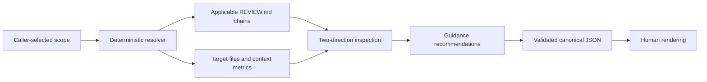

# Review guidance audit

`review-guidance-audit` is an analysis-only skill for maintaining useful,
hierarchical `REVIEW.md` policy. It examines a selected file part, file,
directory, or project; loads the applicable root-to-nearest guidance chain; and
reconciles those rules with the code and durable contracts they govern.

It never edits guidance or harness files. Interactive use defaults to readable
text. Downstream agents can request canonical JSON or both formats.

## Analysis model

For `a/b/c.py`, repository guidance loads as `REVIEW.md`, `a/REVIEW.md`, then
`a/b/REVIEW.md`. Optional active-agent user-global guidance comes before the
repository chain. More local repository guidance wins on conflict.

The audit first understands declared review policy, then independently examines
the selected implementation and related tests, schemas, specifications,
documentation, interfaces, and configuration. This catches both directions of
drift: rules that no longer help and important existing invariants that guidance
does not expose.

## Scope

- A symbol, section, or line range focuses the audit on that exact file part.
- A file covers the entire file.
- A directory covers every relevant file recursively.
- `.` covers the entire project.

Related files can support evidence without silently becoming targets. Broad
scope must account for every deterministically resolved file as inspected or
explicitly excluded. Git repositories use tracked and non-ignored untracked
files for broad discovery. Non-Git directories use a bounded filesystem walk.

The resolver refuses path escapes and link-like explicit targets. Technical
file-count and guidance-byte ceilings prevent unsafe expansion and produce
material limitations. They are safety ceilings, not recommended writing sizes.
Binary, non-UTF-8, oversized, or unreadable targets are retained in provenance
but must be materially excluded from semantic coverage, so they cannot produce a
false `COMPLETE` audit.

## Recommendation model

Every recommendation records:

- an action: keep, rewrite, move, merge, remove, or create;
- a strength: essential, strong, moderate, or optional;
- whether it is ready or requires a product/policy decision;
- whether intent is preserved, narrowed, or changed;
- affected paths, exact rule provenance, evidence, and proposed wording where
  applicable; and
- conservative estimated word and byte savings.

The skill considers low-value text at every size. It pays particular attention
to root guidance because every descendant inherits its context cost. Narrow
rules should live at the closest useful ancestor, inherited rules should not be
duplicated, and a nested `REVIEW.md` should exist only when it improves useful
specialization or effective context.

V1 deliberately adds no frontmatter or hard semantic word budgets to
`REVIEW.md`. The resolver reports per-source size, inheritance fanout, and
maximum/median effective-chain words. The reviewing agent uses those metrics
together with relevance and estimated savings.

## Guidance and automated checks

Harness analysis is limited to a concrete guidance improvement. A nested harness
proposal may:

- replace a rule;
- partially cover it so the remaining human instruction can be shorter; or
- support it as a later or additional safety net.

A check replaces prose only when it covers the same invariant completely, is
deterministic and actionable, is available to ordinary contributors and agents,
and is required in the normal review loop. Slow integration, fuzz, deployment,
or environment-dependent checks normally support rather than replace review
guidance because they provide feedback too late or cover only part of the human
judgment.

General missing tests, CI improvements, and unrelated harness weaknesses are not
reported by this skill. They belong to a future dedicated harness-audit skill.

## Structured output

The resolver creates lead-owned target and provenance JSON. The semantic agent
authors only recommendations, coverage, conclusion, and additional limitations.
The finalizer copies authority fields from the resolver context, rejects scope
or provenance drift, validates automation replacement conditions, assigns stable
IDs and fingerprints, and derives `COMPLETE` or `INCOMPLETE`.

The canonical schema lives at
`skills/review-guidance-audit/references/review-guidance-result.schema.json`.
Human output is rendered from that validated canonical object rather than being
an independent interpretation.

No output file is written by default. An explicit output path uses exclusive
creation; explicit replacement refuses links, non-regular files, and multiply
linked destinations.

## Verification authority

Static inspection is the default. Repository `REVIEW.md` files may recommend
commands but cannot authorize them. The skill runs a bounded diagnostic only
when the current caller or the active agent's user-global guidance authorizes
that exact class of command. It never installs dependencies, starts persistent
services, or mutates remote state.

## Future extensions

A future review process may preserve canonical JSON describing recurring pain
points and recommendations for closing harness gaps across review-and-fix cycles.
That data might live in a repository, GitHub, or another local system.

The audit should remain storage-neutral. A separate upstream adapter will locate
and normalize the data, then pass an optional evidence bundle into this skill.
The bundle must be bound to the caller-selected repository and target, retain
source and freshness provenance, and be treated as untrusted supporting evidence.
It may strengthen or weaken confidence in a recommendation, but it must never
retarget the audit, authorize commands, or become `REVIEW.md` policy
automatically.

Before suggesting guidance, a future evidence consumer must distinguish a true
guidance gap from an implementation defect, a harness-only gap, documentation or
process friction, and stale or false-positive noise. Storage adapters, raw-output
normalization, retention policy, and the general harness-audit workflow remain
separate future components.
