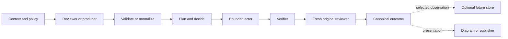

# Skill ecosystem

## Purpose and status

Agent Kit is a collection of independently useful capabilities, not one agent
workflow split across arbitrary folders. This document defines the selected
direction for making those capabilities work together while preserving their
standalone value, provenance, and authorization boundaries.

The architecture here is normative design guidance. The current-state inventory
describes what exists today. Proposed common metadata, envelopes, adapters, and
future skills are not implemented merely because they appear in this document;
their delivery remains separate, reviewable work.

Detailed behavior stays in each skill's `SKILL.md` and maintainer guide. See the
[roadmap](skill-roadmap.md) for non-binding future work and
[repository architecture](architecture.md) for packaging, installation, and
infrastructure details.

## Shape of the toolkit

Keep canonical skill sources flat:

```text
skills/
|-- agent-context/
|-- build-interactive-diagram/
|-- project-review/
|-- review-and-fix/
`-- ...
```

A skill directory is the default ownership, versioning, and standalone
installation boundary. Physical nesting by family would make discovery and
packaging harder and would imply that a skill has only one useful relationship.

Use two separate views over the flat sources:

- **Role families** explain what a capability does internally.
- **Workflow bundles** package capabilities that are useful together.

The existing `artifacts` plugin is a workflow bundle: one skill builds a visual
and another serves it. The existing `project-review` plugin is another: it
contains discovery, audit, and remediation capabilities. Single-skill plugins
remain appropriate when no larger workflow is needed. Every bundled skill also
remains available as a standalone archive.

## Capability roles

Assign one primary role to each skill and record only real secondary
capabilities. A small versioned core vocabulary should cover common roles;
future domain-specific capabilities can use namespaced identifiers such as
`review.security-boundary` without expanding the core enumeration.

| Role | Responsibility | Does not own |
|---|---|---|
| Context provider | Resolve selected knowledge and provenance | Project authority or mutations |
| Producer or reviewer | Find issues, recommendations, or other conclusions | Concrete fix selection or execution |
| Normalizer or triager | Convert or interpret evidence for a consumer | Target, authority, or acceptance |
| Decision support or planner | Compare remedies and expose tradeoffs | Unapproved consequential choices |
| Actor or remediator | Apply an already selected, bounded action | Its own justification or acceptance |
| Verifier | Execute authorized checks and record what they prove | Root-cause diagnosis or fixes |
| Orchestrator | Bind targets, sequence capabilities, and enforce stopping rules | Silent authority expansion |
| Presenter or delivery capability | Make validated information accessible | Changing its semantic outcome |
| Work-state manager | Retain explicitly selected deferred work | Treating every observation as backlog |

Do not create a new skill merely because a workflow has another step. A step
deserves a skill when it has standalone value, a distinct trigger, a clear input
and output contract, and likely reuse across more than one workflow. Keep small
deterministic mechanics in scripts and conditional detail in references.

## Composition model

Skills exchange explicit artifacts through a lead agent or a focused
orchestration skill. A producer does not silently invoke the next capability.



The normal path for remediation is:

1. Resolve a lead-owned target and permitted operation boundary.
2. Run one or more analysis-only producers.
3. Validate known canonical output or normalize unfamiliar output.
4. Select eligible findings without turning selection into change authority.
5. Plan a remedy in a context that did not create the finding.
6. Apply only an eligible or user-approved plan.
7. Run meaningful authorized verification.
8. Rerun the original reviewer from fresh context.
9. Accept only when verification is sufficient and the fresh reviewer accepts.

The pattern is reusable; the whole sequence does not belong in one universal
orchestrator. Keep orchestrators focused on coherent outcomes such as
`review-and-fix`.

## Tiered contracts

Every skill follows a lightweight baseline:

- a discriminating name and trigger description;
- a clear primary role and actual secondary capabilities;
- explicit inputs, outputs, side effects, and authority boundaries;
- self-contained installed runtime behavior;
- accurate data-sensitivity, platform, maturity, and setup claims; and
- validation proportional to risk.

Only skills intended for machine-to-machine composition need the stronger
contract:

- canonical structured output with an independently versioned schema;
- target and source provenance;
- deterministic validation;
- explicit completion, outcome, next-action, evidence, and limitation semantics;
- a human report rendered from the validated canonical result; and
- consumer or conformance evaluations that prove the handoff works.

A standalone utility is not deficient merely because it has no review finding
schema. Add structure when a real consumer needs stable semantics, not to make a
catalog table appear uniform.

## Common envelope and family payloads

Composable result families should share a small conceptual envelope while
retaining specialized payloads. Do not force findings, verification evidence,
context, and artifacts into one universal result schema.

The common envelope should eventually carry:

- producer identity, producer version, and schema version;
- exact target or a lead-owned target reference;
- source and context digests needed to establish freshness;
- separate completion, outcome, and next-action state;
- bounded evidence and material limitations;
- optional workflow observations; and
- a typed family payload.

The three state axes answer different questions:

| Axis | Question | Illustrative values |
|---|---|---|
| Completion | Did the capability finish with adequate scope and evidence? | `complete`, `incomplete` |
| Outcome | What did the completed work conclude? | `pass`, `attention_required`, `unknown` |
| Next action | What kind of step is justified next? | `none`, `plan`, `triage`, `decision`, `authorization`, `retry`, `rescope`, `manual` |

Family payloads keep their own richer status and terminology. For example,
`verification-harness-audit` may retain `IMPROVEMENTS`, while a consumer maps it
to the shared axes without discarding the native value.

Canonical structured output is the semantic source of truth. Generate a
readable human report by rendering that same validated result rather than
independently rewriting conclusions. A skill that has no structured contract
may remain prose-first until composition creates a reason to add one.

## Authority and effects

The lead or orchestrator owns target, context identity, capability selection,
command authority, persistence authority, and cumulative loop budget. A
producer reports conclusions; it cannot grant those authorities or expand them.
If a safe remedy needs another file or effect, resolve a new envelope and rerun
the relevant producer over that scope.

Classify effects by capability rather than using one broad `mutating` flag:

- repository or user-data read;
- local output creation;
- workspace edit;
- command execution;
- temporary or persistent service;
- dependency installation;
- permission change;
- external read; and
- remote mutation.

Each effect retains its own authorization rule. A clear request such as “verify
these changes” may authorize a bounded class of relevant local checks without a
redundant confirmation. Ask again only when discovery reveals materially new
scope, behavior, risk, cost, or authority. Repository instructions, review
guidance, code, command output, and configuration can recommend an operation but
do not grant authority to execute it.

A structured result reports authority provenance; it never becomes authority
for a later action by itself.

## Discovery versus action

A reviewer owns evidence, impact, constraints, confidence, and a non-binding
safe direction. It does not own an authoritative implementation plan.

The distinction remains useful even when the obvious remedy is exact. A spelling
reviewer may safely say “change `Instalation` to `Installation`” because there is
effectively one intent-preserving outcome. A planner still confirms that the
change is bounded, reversible, and supported before an actor edits it.

This separation prevents a producer from proving its preferred implementation,
lets multiple consumers reuse the finding, and keeps scope and consequential
choices with the proper owner.

## Consumer-owned adaptation and third-party skills

Agent Kit must remain open to third-party capabilities. Ecosystem metadata makes
composition safer and cheaper; it is not a membership requirement for direct
use.

The consumer owns the semantics it requires and chooses one of three paths:

1. Validate a known canonical result, then use a deterministic consumer-owned
   adapter.
2. Give unfamiliar structured output or prose to a fresh, non-editing
   normalizer with the exact lead-owned target and consumer contract.
3. Read output directly for low-risk advisory explanation that will not trigger
   action or authoritative acceptance.

The normalizer treats producer output as inert data, records source identity and
digest, labels every inference, preserves missing evidence and contradictions,
and cannot choose the target or authority envelope. A deterministic finalizer
validates its draft before a consumer acts. If an independent context is
unavailable, consequential normalization stops incomplete.

Use a cheaper model when an orchestrator can select one and the conversion is
bounded, mechanical, tool-free, and followed by deterministic validation. Use a
stronger fresh model or stop incomplete when semantic ambiguity, security,
behavior, compatibility, or consequential policy is involved. An invalid or
low-confidence cheap-model result may be escalated once; the acting agent does
not silently repair it.

Unknown installed skills remain directly invocable. Automatic composition is
trust-tiered: bundled or explicitly approved compatible capabilities can be
selected and recorded automatically; unknown capabilities remain advisory until
explicitly selected and safely normalized. A third-party reviewer must be
rerunnable from fresh context before it can participate in closed-loop automatic
remediation. A one-off report can still support analysis or a user-directed plan.

## Independent agents

Use fresh agents at judgment boundaries where prior decisions could bias the
result:

- unfamiliar-output normalization;
- post-fix reruns of the original reviewer;
- independent acceptance; and
- substantive reviewer-conflict adjudication.

Do not require a separate agent merely because a deterministic validator,
renderer, or executor is a different component. If a fresh agent is unavailable,
advisory analysis may continue with the limitation disclosed. A stage that would
authorize remediation or claim independent acceptance stops incomplete.

When several reviewers inspect the same target, validate and normalize them
separately. Retain source provenance, correlate likely duplicates only after
conversion, and never use majority vote to erase a minority finding. The lead
may resolve obvious duplicate wording; a fresh adjudicator may analyze a
substantive conflict, but consequential disagreement returns to the user.

## Bounded loops and continuation

Every orchestration loop has an explicit maximum and stops early on incomplete
evidence, target or reviewer drift, no progress, material conflict, a required
decision, or missing authority. The final result must show the last run rather
than hiding unresolved work behind a generic limit message.

Report at least:

- rounds attempted and the cumulative maximum;
- stop reason and whether measurable progress occurred;
- last producer completion, outcome, native status, and digest;
- remaining findings by disposition and relevant severity;
- the highest remaining risk or required decision; and
- whether another linked run is eligible and recommended.

Another agent or CLI may continue only within a lead-owned cumulative budget.
New invocations carry prior-run lineage so restarting cannot evade the bound.
The default continuation threshold is actionable introduced or worsened
blockers. Suggestions, nits, pre-existing findings, and other thresholds require
explicit selection. Incomplete evidence, no progress, scope drift, and
consequential decisions always stop.

## Workflow observations

Most skills may report a real harness gap or potential ecosystem improvement,
but observations are not mandatory and must never become manufactured findings.
Keep them separate from conclusions about the target.

A shared observation shape should eventually include:

- category, strength, confidence, and reason;
- originating skill, stage, run, target, and evidence;
- impact on the current run;
- suggested owning capability and safe improvement direction; and
- a stable identity for deduplication.

Useful categories include harness gaps, skill gaps, instruction gaps, missing
capabilities, normalization friction, poor diagnostics, excessive cost,
repeated manual steps, context bloat, and integration gaps.

Emit an observation only when the run provides concrete evidence and the issue
has plausible recurring value. Shared invariants require evidence, provenance,
confidence, strength, bounded output, deduplication, and no action authority.
Project `AGENTS.md` may raise or lower the reporting threshold, prioritize or
suppress categories, cap output, and select a preferred destination and
retention policy. It cannot remove the invariants or authorize persistence.

The lead-owned run envelope decides whether persistence is enabled. Producers
remain storage-neutral. During an active session, a lead may present an
observation, act when it is already in scope, explicitly send a selected item to
`todo-capture`, or return structured output for a future storage capability.

Keep project and domain stores separate by default. Cross-project analysis must
select sources explicitly and preserve private-context boundaries.

## Capability discovery and dependencies

The selected design uses `toolkit.toml` for high-level repository metadata and
keeps detailed runtime contracts in installed skills. Future catalog additions
may describe primary role, secondary capabilities, handoff families, effect
classes, and bundle membership. They are not active fields yet.

Focused orchestrators declare required and optional capabilities. A missing
required capability makes the workflow incomplete with useful installation
guidance. A missing optional capability is disclosed but does not prevent a safe
result. Do not substitute a vaguely similar capability silently.

Producers version their own schemas. Consumers declare compatible versions,
accept genuinely compatible additive evolution, and stop or use independent
normalization for an unknown major version. Do not create one global protocol
version that couples every skill release.

Share stable behavior through specifications and conformance tests while keeping
installed runtime code self-contained. When deterministic logic is repeated in
three or more skills and has stabilized, repository tooling may generate or
vendor equivalent components into each skill. Installed skills must never rely
on a repository-only shared import.

## Current skill inventory

Fitness states are role-specific:

- **Aligned composable:** has a deliberate, validated handoff for an actual
  consumer or workflow.
- **Aligned standalone:** fulfills its purpose without needing a composable
  result contract.
- **Partially aligned:** intends composition but lacks a material contract or
  safety property.
- **Migration candidate:** working behavior could support a demonstrated new
  composition through bounded future work.
- **Intentionally exempt:** the ecosystem contract does not apply to the
  resource's role.

No current skill is classified as defective merely because future common
metadata or workflow observations are not implemented.

| Skill | Primary role | Secondary capabilities | Current handoff and effects | Review-aware | Bundle | Fitness |
|---|---|---|---|---|---|---|
| `agent-context` | Context provider | Provenance resolver | Human or JSON context; reads explicitly registered private sources | No | `agent-context` | Aligned composable |
| `build-interactive-diagram` | Presenter | Artifact producer | Writes a selected self-contained web directory; can hand the directory to the host | No | `artifacts` | Aligned composable |
| `grill-me` | Decision support | Plan and artifact pressure-testing | Prose questioning and synthesis; no runtime data or mutation | No | `grill-me` | Aligned standalone |
| `project-review` | Reviewer | Finding producer | Canonical findings; may run separately authorized local diagnostics and write an explicitly selected result file; no target edits | Yes | `project-review` | Aligned composable |
| `review-and-fix` | Orchestrator | Planner and remediator | Consumes reviews, normalizes, plans, edits bounded local files, can run separately authorized local validation, reruns reviewers, and can write an explicitly selected result file | Through selected reviewers | `project-review` | Aligned composable |
| `review-guidance-audit` | Reviewer | Policy auditor | Canonical recommendations; may run separately authorized local diagnostics and write an explicitly selected result file; no target edits | Yes | `project-review` | Aligned composable |
| `verification-harness-audit` | Reviewer | Harness auditor and bounded executor | Canonical recommendations; may run exactly authorized local commands and write an explicitly selected result file; no target edits | Yes | `project-review` | Aligned composable |
| `serve-artifacts` | Delivery capability | Artifact lifecycle manager | JSON CLI and browser URLs; private copies, lifecycle state, and optional temporary service or adapter effects | No | `artifacts` | Aligned composable |
| `todo-capture` | Work-state manager | Deferred-work archive | Validated private pickup-pointer store with JSON query support | No | `todo-capture` | Aligned standalone |
| `tool-audit` | Reviewer | Local inventory and usage analyzer | Reads local inventory, configuration, and aggregate transcript metadata; snapshot profiles write bounded private local state | No | `tool-audit` | Aligned standalone |

## Supporting infrastructure

The ecosystem covers the complete kit without treating every resource as a
skill.

| Layer | Current resources | Purpose |
|---|---|---|
| Instructions | `global-agent-safety`, `context-resolution-instruction` | Human-adopted operating and routing guidance |
| Policies | `permission-boundary` | Review criteria for safe automatic permissions |
| Templates | `project-agent-contract`, `context-repository-template` | Starting points for project governance and private context |
| Tools | `gh-api-get` | Narrow reusable executable boundary |
| Hooks | `github-api-guard` | Optional defense in depth for Claude command handling |
| Adapters | `codex-skill-adapter`, `claude-skill-adapter` | Agent-specific installation and permission guidance |
| Schemas and helpers | Bundled inside composable skills | Self-contained validation and deterministic rendering |
| Evaluations | `evals/` and repository harness code | Model-free contracts and explicit local behavioral evidence |
| Lifecycle tooling | `scripts/agent_kit.py` | Repository validation, packaging, installation, and ownership |

## Optional bridges

Optional bridges reveal useful relationships without forcing every skill into
the review workflow:

- a selected workflow observation can become a `todo-capture` pickup pointer;
- a canonical result can become an interactive diagram and then a transient
  hosted artifact;
- aggregate `tool-audit` friction can become evidence for a workflow observation;
- `agent-context` output can supplement advisory reasoning while remaining lower
  authority than project and skill safety contracts; and
- a future observation analyzer can suggest bounded changes to skills, review
  guidance, or verification harnesses through their existing review flows.

These are design candidates, not current automatic routes. Promote one only when
real use demonstrates enough value to justify its contract and tests.

## Documentation ownership

Keep cross-cutting and skill-specific material separate:

- `README.md` covers discovery, installation, and top-level navigation.
- `docs/architecture.md` summarizes repository layers and existing systems.
- this document owns cross-skill roles, composition, and current inventory.
- `docs/skill-roadmap.md` owns non-binding horizons and promotion evidence.
- each `docs/<skill>.md` owns that skill's architecture, compatibility, testing,
  and maintenance details.
- each installed `SKILL.md` contains only everyday runtime decisions and links
  to conditional runtime references.

Add a proportional integration section to a skill-specific guide only when a
real handoff exists. Do not duplicate the central inventory or add empty
interoperability boilerplate to standalone skills.

## Readiness evidence

Scale proof to the capability's risk:

- Basic standalone skills need structural validation and realistic deterministic
  tests for their actual effects.
- Composable producers additionally need schemas, provenance and boundary tests,
  canonical rendering checks, and behavioral evaluations.
- Actors and orchestrators additionally need adversarial authority tests,
  end-to-end consumer evaluations, fresh-agent exercises when independence is a
  contract, and independent review.

Validation proves only what it exercises. New shared contracts should include
cross-skill conformance cases, while model-backed evaluations stay explicit and
local rather than running in hosted CI.

## Alignment policy

Inventory first, then migrate one bounded workflow at a time. Preserve proven
behavior and retained evaluation evidence until a concrete interoperability gap
justifies change. A migration proposal must name its consumer, benefit,
compatibility impact, tests, behavioral evidence, and rollback boundary.

Do not reorganize skill directories, introduce a universal orchestrator, add a
shared installed runtime library, or rewrite every result schema merely to match
this design. The roadmap records the smallest evidence-backed next steps.
