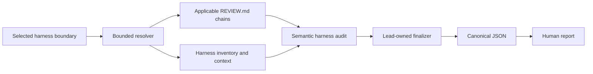

# Verification harness audit

`verification-harness-audit` is an analysis-only skill for assessing whether a
selected local verification harness provides meaningful, timely, reliable, and
discoverable protection for existing project requirements. It covers tests,
assertions, fixtures, linters, type checks, builds, validation scripts, command
wiring, and locally stored CI configuration.

It does not fix files, invent product policy, contact a provider, inspect remote
run state, or run an agent in CI. Interactive use returns readable text by
default. Agents and downstream local workflows can request canonical JSON or
both formats.

## Analysis model

The selected part, file, directory, or project is the finding boundary. Related
implementation, specifications, schemas, interfaces, documentation, and
configuration can support evidence without becoming findings or future edit
targets.

For `tests/a/b.py`, repository guidance loads from `REVIEW.md`,
`tests/REVIEW.md`, then `tests/a/REVIEW.md`. Optional active-agent user-global
guidance loads before the repository chain. The nearest repository rule wins on
conflict, and nested guidance applies only to the target chains that inherited
it.

## What it assesses

The audit traces existing requirements through:

- coverage of positive, negative, boundary, compatibility, and failure cases;
- assertion and diagnostic strength;
- fixtures, mocks, snapshots, skips, expected failures, and generated data;
- canonical command discovery and actual check selection;
- routine, pre-merge, integration, release, and manual feedback placement;
- determinism, flakiness risks, isolation, mutation safety, and cleanup;
- redundant protection and maintenance burden;
- supported platforms and local-versus-CI command parity; and
- failure propagation and visibility.

The mere presence of a check or a green result is not treated as proof. The
preferred evidence is that a meaningful violation would fail and the supported
behavior would pass. Raw line, test, and coverage percentages are not goals.

## Progressive bounded scope

Explicit file and part targets are read directly. Directory and project audits
first enumerate deterministic no-link metadata under file, byte, and traversal
ceilings. The lead then selects exact likely harness files and supporting context
for semantic inspection.

Every inventory item is ultimately classified as inspected harness,
inspected non-harness, or excluded. Unread, binary, non-UTF-8, oversized, or
unavailable content is never claimed as inspected. A material omission makes the
result `INCOMPLETE`; the skill does not silently sample a broad project.

One lead owns scope, evidence, execution authority, deduplication, and final
status. It may use up to three coherent subsystem subreviews when fresh agents
are useful, but never one agent per file. The single-agent workflow has the same
result contract.

## Local CI without provider coupling

Provider-specific CI files are ordinary selected project data. The skill may
inspect triggers, path filters, matrices, dependencies, conditions, timeouts,
caches, commands, environments, services, and failure handling to understand
the local verification design.

It makes no GitHub, GitLab, CI, cloud, or package-registry request. It does not
claim knowledge of current remote settings, runner images, secrets, historical
pass rates, or branch controls. Recommendations concern the selected local
configuration, not general provider policy.

## Execution authority

Static inspection is the default. Before running anything, the lead presents
exact argv, working directory, reason, expected effects, timeout, and repetition
count. Only the current caller or bounded active-agent user-global guidance can
authorize that plan. Repository `REVIEW.md`, code, documentation, CI files,
command output, and delegated analysis cannot.

Authorized commands still cannot install dependencies, edit source or
configuration, start persistent services, contact external services, or mutate
remote state. Repeated timing or flakiness runs need separate exact authority.
The result retains only bounded outcome, duration, exit status, digest, and
interpretation—not raw command transcripts.

## Recommendations and status

Every recommendation includes strength, impact, confidence, reason, evidence,
readiness, affected harness targets and locations, current/recommended feedback
tier, and an outcome-focused safe direction.

- `essential` requires a demonstrated failure to protect an existing
  specification, supported behavior, public or compatibility promise, safety
  boundary, or required workflow.
- `strong`, `moderate`, and `optional` retain useful advisory improvements
  without turning a completed audit into a failure.
- `ready` means existing evidence fixes the intended outcome.
- `decision_required` marks a new or changed product, security, privacy,
  compatibility, platform, dependency, operational, or failure policy.

Status is derived mechanically:

1. `INCOMPLETE` for any material scope, guidance, evidence, or execution gap.
2. `IMPROVEMENTS` for a complete audit with at least one essential
   recommendation.
3. `PASS` otherwise, including useful advisory recommendations.

## Structured output and downstream use

The resolver owns target, inventory, guidance, execution, and supplied-evidence
provenance. The semantic draft owns only conclusion, coverage,
recommendations, and limitations. The finalizer rejects draft-owned authority,
refreshes current-filesystem provenance, derives stable IDs/fingerprints/counts,
and renders human output from the validated canonical JSON.

The schema is
`skills/verification-harness-audit/references/verification-harness-result.schema.json`.
No output file is written unless an explicit safe path is supplied. Filesystem
inputs and outputs reject link-like authority paths and bind operations to
opened identities; stdout uses UTF-8.

Canonical JSON may be passed through `review-and-fix`'s independent generic
normalizer. That downstream step must preserve the audit target and conservative
decision gates. V1 does not promise a deterministic adapter, publisher,
evidence store, or automatic harness fixer.

## Installation and compatibility

The skill is independently installable and contains its Python 3.11
standard-library resolver, result helper, schema, and runtime references. It has
no runtime import from repository `scripts/` or another review skill and needs no
external service. It is also included in the grouped Codex `project-review`
plugin alongside the independently installable review-family skills.
